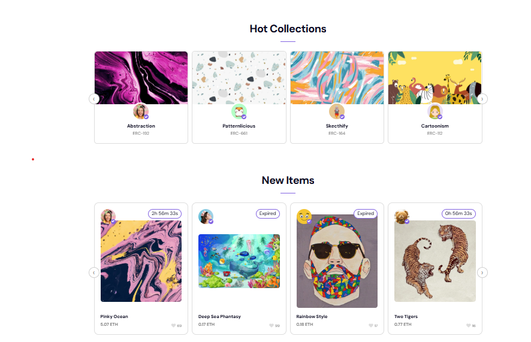

<h1 align="center">NFT Marketplace</h1>

<p align="center">
  
  
  
  
</p>
<p align="center">
  
</p>

# 🎨 NFT Marketplace

A responsive NFT marketplace built with React and JavaScript featuring modern UI components, filtering functionality, smooth animations, and a responsive user experience.

## Live Demo

https://mona-internship-9lqz.vercel.app/

---

## Overview

This project was built from a provided Figma design and project requirements as part of a Front-End Development program.

The goal was to implement a modern NFT marketplace interface using reusable React components and responsive layouts.

---

## Features

- Responsive Design
- React Components
- Dynamic UI
- NFT Collections
- Category Navigation
- Smooth Animations
- Modern Layout
- Clean User Interface

---

## Tech Stack

- React
- JavaScript
- HTML5
- CSS3
- Create React App
- Vercel

---

## What I Built

I implemented the front-end application from the provided design requirements.

My work included:

- Building reusable React components
- Creating responsive layouts
- Developing NFT collection pages
- Implementing navigation
- Creating interactive UI components
- Deploying the application using Vercel

---

## Challenges

The main challenges included:

- Building reusable React components
- Creating responsive layouts
- Maintaining consistent styling
- Organizing component structure

---

## What I Learned

Through this project I improved my understanding of:

- React
- Component Architecture
- Responsive Design
- UI Development
- JavaScript
- CSS

---

## Installation

```bash
git clone https://github.com/MRP8490/Mona---Internship.git
```

```bash
cd Mona---Internship
```

```bash
npm install
```

```bash
npm start
```

---

## Future Improvements

- Add TypeScript
- Improve Accessibility
- Add Unit Testing
- Improve Performance
- Add GitHub Actions

---

## Author

**Mona Hadizadeh**

Portfolio

https://mona-portfolio-chi.vercel.app

LinkedIn

https://www.linkedin.com/in/mona-r84/

GitHub

https://github.com/MRP8490